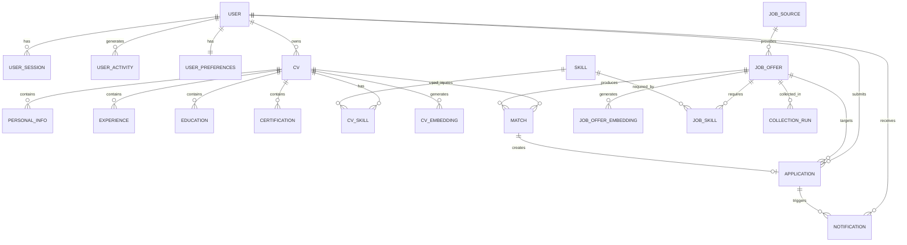
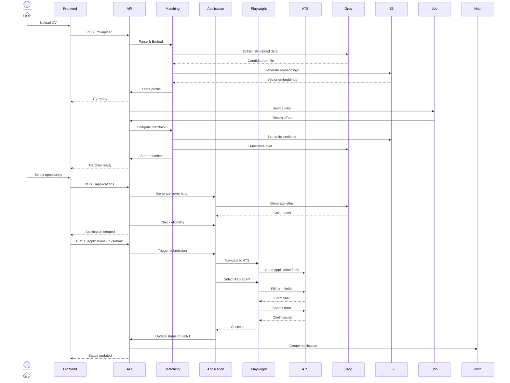

# Plateforme intelligente de recrutement basée sur des agents d'intelligence artificielle

**AI-Powered Intelligent Recruitment Agent Platform**

---

## Table des matières

1. [Introduction](#1-introduction)
2. [Aperçu général du système](#2-apercu-général-du-système)
3. [Architecture fonctionnelle](#3-architecture-fonctionnelle)
4. [Architecture de la base de données](#4-architecture-de-la-base-de-données)
5. [Architecture backend](#5-architecture-backend)
6. [Architecture frontend](#6-architecture-frontend)
7. [Architecture IA](#7-architecture-ia)
8. [Gestion des utilisateurs](#8-gestion-des-utilisateurs)
9. [Gestion des CV](#9-gestion-des-cv)
10. [Sourcing d'offres d'emploi](#10-sourcing-doffres-demploi)
11. [Moteur de matching](#11-moteur-de-matching)
12. [Gestion des candidatures](#12-gestion-des-candidatures)
13. [Automatisation des navigateurs / Intégration ATS](#13-automatisation-des-navigateurs--intégration-ats)
14. [Système de notifications](#14-système-de-notifications)
15. [Documentation API](#15-documentation-api)
16. [Sécurité](#16-sécurité)
17. [Gestion des erreurs](#17-gestion-des-erreurs)
18. [Stratégie de tests](#18-stratégie-de-tests)
19. [Limitations actuelles](#19-limitations-actuelles)
20. [Améliorations futures](#20-améliorations-futures)
21. [Décisions techniques](#21-décisions-techniques)
22. [Diagrammes d'architecture](#22-diagrammes-darchitecture)

---

## 1. Introduction

### 1.1 Contexte

Le processus de recrutement traditionnel impose aux candidats des tâches chronophages et répétitives :

- **Recherche manuelle** sur plusieurs plateformes d'emploi (LinkedIn, Indeed, sites spécialisés)
- **Analyse** de nombreuses descriptions de poste pour identifier les opportunités pertinentes
- **Comparaison** des exigences du poste avec leur profil personnel
- **Préparation** de candidatures personnalisées (lettres de motivation, emails)
- **Remplissage** de formulaires d'application répétitifs (name, email, phone, CV, questions spécifiques)
- **Suivi** des candidatures envoyées sur différents systèmes ATS (Applicant Tracking System)
- **Gestion** de multiples processus de candidature simultanés

L'automatisation et l'intelligence artificielle peuvent considérablement réduire cette charge cognitive et temporelle en :

- **Automatisant** la découverte d'opportunités pertinentes
- **Évaluant** la compatibilité entre profil et poste de manière structurée
- **Générant** des candidatures personnalisées
- **Remplissant** automatiquement les formulaires d'application
- **Suivant** le statut des candidatures de manière centralisée

### 1.2 Problématique

Comment une plateforme intelligente peut-elle assister un candidat dans la découverte d'opportunités pertinentes, l'évaluation de compatibilité, la préparation de candidatures et l'automatisation des tâches répétitives d'application tout en maintenant la fiabilité, l'explicabilité et le contrôle humain ?

La plateforme doit équilibrer :

- **Automatisation** des tâches répétitives vs **contrôle humain** sur les décisions importantes
- **Intelligence IA** vs **logique déterministe** pour la fiabilité
- **Personnalisation** vs **généricité** des candidatures
- **Vitesse** vs **précision** dans le matching
- **Autonomie** vs **sécurité** dans les actions d'application

### 1.3 Objectifs du projet

#### Objectifs fonctionnels
- Permettre aux candidats d'uploader leur CV et de créer un profil structuré
- Sourcer automatiquement des offres d'emploi depuis plusieurs plateformes
- Évaluer la compatibilité entre profil candidat et offres d'emploi
- Générer des lettres de motivation personnalisées
- Automatiser le remplissage de formulaires d'application sur différents ATS
- Suivre le statut des candidatures envoyées
- Notifier les candidats des mises à jour importantes

#### Objectifs techniques
- Architecture modulaire permettant l'ajout de nouvelles sources d'emploi
- Séparation claire entre logique métier et infrastructure
- Résilience face aux variations des formulaires web
- Extensibilité pour l'ajout de nouveaux ATS agents
- Performance acceptable pour les opérations vectorielles

#### Objectifs IA
- Utiliser l'IA de manière sélective plutôt que comme dépendance système
- Combiner matching sémantique (embeddings) et règles métier déterministes
- Employer LLM pour la génération de contenu personnalisé et l'évaluation qualitative
- Maintenir l'explicabilité des décisions de matching

#### Objectifs d'automatisation
- Réduire le temps passé sur les tâches administratives
- Maintenir le contrôle humain sur les décisions finales
- Permettre l'intervention humaine sur les cas bloqués (CAPTCHA, login, questions complexes)

### 1.4 Portée

#### ✅ Implémenté
- Authentification JWT avec refresh tokens
- Upload et parsing de CV (PDF)
- Extraction structurée via LLM (Groq)
- Génération d'embeddings (multilingual-e5-large)
- Stockage vectoriel (pgvector)
- Sourcing d'offres (Arbeitnow, Indeed, Remotive, LinkedIn limité)
- Normalisation des offres d'emploi
- Matching 6-facteurs (skills, expérience, séniorité, sémantique, LLM, certifications)
- Génération de lettres de motivation
- Détection et navigation vers ATS (Greenhouse, Lever, Ashby, Gem, Generic)
- Remplissage automatique de formulaires
- Capture d'écrans résiliente
- Système de notifications
- Human-in-the-loop pour questions bloquantes
- Log d'activité des agents

#### 🟡 Partiellement implémenté
- LinkedIn : scraping limité, pas d'accès API officiel
- OCR : non implémenté (seuls PDF textuels supportés)
- File upload de CV : validation limitée (PDF uniquement)
- CAPTCHA : détection mais non contournement (par design)

#### 🔵 Future work
- Filetypes supplémentaires (DOCX, TXT)
- OCR pour PDF scannés
- Additional ATS agents (Workable, SmartRecruiters, etc.)
- Task queue persistant (actuellement BackgroundTasks)
- WebSockets pour notifications en temps réel
- Analytics et monitoring avancé
- Amélioration de la déduplication d'offres

#### ❌ Non implémenté
- Audio/Video CV parsing
- Social media scraping (LinkedIn, GitHub automatique)
- Téléchargement automatique de portfolios
- Integration avec Google Drive/Dropbox
- SMS/Email notifications

---

## 2. Aperçu général du système

### Flux utilisateur complet

```
Utilisateur
    ↓
Authentification (JWT)
    ↓
Création profil & préférences
    ↓
Upload CV (PDF)
    ↓
Extraction textuelle (pdfplumber)
    ↓
Parsing structuré (Groq LLM)
    ↓
Profil candidat structuré
    ↓
Génération embeddings (multilingual-e5-large)
    ↓
Stockage vectoriel (pgvector)
    ↓
Sourcing d'offres (Arbeitnow, Indeed, Remotive, LinkedIn)
    ↓
Normalisation des offres
    ↓
Matching (6-facteurs)
    ↓
Score de compatibilité (0-100)
    ↓
Opportunités pertinentes
    ↓
Décision d'application
    ↓
Mode d'application (RECOMMEND_ONLY / ASSISTED / AUTO_APPLY)
    ↓
Génération lettre de motivation
    ↓
Détection ATS
    ↓
Navigation navigateur (Playwright)
    ↓
Découverte lien d'application
    ↓
Validation destination
    ↓
Sélection agent ATS
    ↓
Remplissage formulaire
    ↓
Intervention humaine si nécessaire
    ↓
Soumission
    ↓
Notification / suivi
```

---

## 3. Architecture fonctionnelle

### 3.1 Gestion des utilisateurs

**Technologies :** FastAPI, SQLAlchemy, JWT (bcrypt), PostgreSQL

**Fonctionnalités implémentées :**

- **Inscription** : Création de compte avec email et mot de passe
- **Connexion** : Authentification JWT avec access token (15 min) et refresh token (7 jours)
- **OAuth** : Intégration GitHub et Google (flux OAuth2)
- **Réinitialisation mot de passe** : Flow par email avec token unique expirant
- **Préférences utilisateur** : Configuration de recherche et autonomie agent
  - Mots-clés de recherche
  - Localisations préférées
  - Types de contrat (CDI, CDD, STAGE, FREELANCE)
  - Préférence remote
  - Salaire minimum
  - Rôles cibles
  - Mode d'application (RECOMMEND_ONLY / ASSISTED / AUTO_APPLY)
  - Score de compatibilité minimum (défaut 80%)
  - Limite quotidienne d'applications (défaut 5)

**Endpoints principaux :**

| Méthode | Endpoint | Description |
| ------- | -------- | ----------- |
| POST | /auth/register | Inscription |
| POST | /auth/login | Connexion |
| POST | /auth/logout | Déconnexion |
| POST | /auth/refresh-token | Refresh access token |
| POST | /auth/reset-password | Demande reset mot de passe |
| POST | /auth/reset-password/confirm | Confirmation reset |
| POST | /auth/github/callback | Callback GitHub OAuth |
| POST | /auth/google/callback | Callback Google OAuth |
| GET | /auth/me | Informations utilisateur |
| PUT | /preferences | Mise à jour préférences |

**Modèles de données :**
- `User` : email, hashed_password, is_active, created_at
- `UserSession` : token, refresh_token, user_agent, ip_address, expires_at
- `UserActivity` : action, description, ip_address, user_agent, created_at
- `UserPreferences` : job_keywords, preferred_locations, preferred_contract_types, remote_preference, min_salary, target_roles, application_mode, min_match_score, max_applications_per_day
- `UserPasswordReset` : token, expires_at, is_used

---

### 3.2 Gestion des CV

**Technologies :** pdfplumber, Groq LLM (Llama models), multilingual-e5-large, pgvector

**Pipeline complet :**

1. **Upload CV**
   - Validation : PDF uniquement (via filetype library)
   - Taille max : 10 MB
   - Rate limiting : 5 uploads/minute par utilisateur
   - Stockage : fichier système local (`uploaded_cvs/`)

2. **Extraction textuelle**
   - Adapter : `PdfTextExtractor`
   - Utilise pdfplumber pour extraire le texte brut
   - Gestion des erreurs : PDF encrypté, scanné, malformé

3. **Parsing structuré (LLM)**
   - Adapter : `GroqLLMExtractor`
   - LLM : Groq API (modèles Llama)
   - Extraction :
     - Informations personnelles (nom, email, téléphone, localisation, LinkedIn, GitHub)
     - Expériences professionnelles (titre, entreprise, dates, description)
     - Formation (diplôme, institution, dates)
     - Certifications
     - Compétences (avec normalisation)

4. **Normalisation des compétences**
   - Service : `SkillNormalizationService`
   - Mapping vers noms canoniques
   - Classification par catégorie

5. **Génération d'embeddings**
   - Adapter : `E5EmbeddingProvider`
   - Modèle : `intfloat/multilingual-e5-large`
   - Dimension : 1024 vecteurs
   - Stockage : pgvector (extension PostgreSQL)

6. **Stockage structuré**
   - Tables relationnelles pour données structurées
   - JSON pour métadonnées
   - CASCADE pour suppression en cascade

**Endpoints principaux :**

| Méthode | Endpoint | Description |
| ------- | -------- | ----------- |
| GET | /cv | Liste des CVs |
| POST | /cv/upload | Upload et parsing CV |
| GET | /cv/{cv_id} | Détails CV |
| PUT | /cv/{cv_id}/personal-info | Mise à jour infos personnelles |
| DELETE | /cv/{cv_id} | Suppression CV |
| GET | /cv/{cv_id}/status | Statut parsing |
| POST | /cv/{cv_id}/reparse | Re-parsing CV |

**Modèles de données :**
- `CV` : id, user_id, filename, raw_file_url, language, status, created_at, parsed_at, failure_reason
- `PersonalInfo` : full_name, email, phone, location, linkedin_url, github_url, salary_expectation
- `Experience` : title, company, start_date, end_date, description, is_current
- `Education` : degree, institution, field, start_date, end_date
- `Certification` : name, issuer, date_obtained, expiry_date
- `CVSkill` : skill_id, proficiency, source, years_experience
- `Skill` : canonical_name, category
- `CVEmbedding` : vector (1024), model_name

---

### 3.3 Sourcing d'offres d'emploi

**Technologies :** Python requests, schedulers APScheduler

**Sources d'offres implémentées :**

| Source | Type | Méthode | Statut |
| ------ | ---- | -------- | ------ |
| Arbeitnow | API publique | REST API | ✅ Implémenté |
| Indeed | Scraping | BeautifulSoup | ✅ Implémenté |
| Remotive | API publique | REST API | ✅ Implémenté |
| LinkedIn | Scraping limité | BeautifulSoup | 🟡 Partiel |
| Bundesagentur | Scraping | BeautifulSoup | ✅ Implémenté |
| Jobicy | Scraping | BeautifulSoup | ✅ Implémenté |
| TanitJobs | Scraping | BeautifulSoup | ✅ Implémenté |
| The Muse | Scraping | BeautifulSoup | ✅ Implémenté |

**Fonctionnalités :**

- **Collection automatique** : Scheduler APScheduler (toutes les 24h)
- **Normalisation** : Service de normalisation des offres
- **Déduplication** : Par fingerprint SHA256 du contenu
- **Embeddings** : Génération et stockage vectoriel des offres
- **Extraction de compétences** : Parsing des compétences requises
- **Extraction de certifications** : Backfill de standards de certifications

**Endpoints principaux :**

| Méthode | Endpoint | Description |
| ------- | -------- | ----------- |
| GET | /jobs | Liste des offres |
| GET | /jobs/{id} | Détails offre |
| POST | /jobs/search | Recherche avancée |
| POST | /jobs/trigger-sourcing | Déclenchement manuel sourcing |

**Modèles de données :**
- `JobSource` : name, type, base_url, is_active
- `JobOffer` : source_id, source_url, fingerprint, title, company, location, description, required_skills, contract_type, posted_at, collected_at, status, required_certifications, preferred_certifications
- `JobOfferEmbedding` : job_offer_id, vector (1024), model_name
- `JobSkill` : job_offer_id, skill_id, importance (essential/nice_to_have)
- `CollectionRun` : source_id, started_at, finished_at, offers_collected, status, error_message
- `CertificationStandard` : canonical_name, aliases, category, description

---

### 3.4 Moteur de matching

**Technologies :** pgvector, Groq LLM, Scoring déterministe

**Architecture 6-facteurs :**

| Critère | Poids | Description |
| -------- | -----: | ----------- |
| Compétences | 35% | Matching compétences essentielles et nice-to-have |
| Expérience pertinente | 20% | Relevance expérience vs exigences |
| Alignement séniorité | 10% | Niveau d'expérience requis vs candidat |
| Similarité sémantique | 15% | Cosine similarity embeddings CV/offre |
| Évaluation LLM qualitative | 10% | Analyse qualitative par LLM |
| Bonus certifications | 5% | Certifications requises possédées |

**Formule mathématique :**

```
Score de compatibilité = Skills Score + Experience Score + Seniority Score + Semantic Score + LLM Score + Certification Bonus

Où :
- Skills Score = (Essential match × 0.7 + Nice-to-have match × 0.2) × 35
- Experience Score = Relevance × 20
- Seniority Score = Alignment × 10
- Semantic Score = Cosine Similarity × 15
- LLM Score = Qualitative evaluation × 10
- Certification Bonus = Min(certifications possédées / requises × 5, 5)
```

**Composants :**

- **ScoringService** : Calcul de chaque facteur individuel
- **MatchingService** : Orchestration du matching global
- **PgVectorSimilarityCalculator** : Calcul similarité cosinus
- **GroqMatchingEvaluator** : Évaluation qualitative LLM

**Endpoints principaux :**

| Méthode | Endpoint | Description |
| ------- | -------- | ----------- |
| GET | /matching/cv/{cv_id}/job/{job_offer_id} | Obtenir match existant |
| POST | /matching/cv/{cv_id}/job/{job_offer_id} | Calculer match |
| GET | /matching/cv/{cv_id}/best-matches | Meilleurs matches pour CV |
| GET | /matching/config | Configuration matching |
| PUT | /matching/config | Mise à jour configuration |
| POST | /matching/trigger-matching | Déclenchement matching |

**Modèles de données :**
- `Match` : cv_id, job_offer_id, semantic_similarity, llm_score, compatibility_score, skills_score, experience_score, seniority_score, semantic_score, certification_bonus, matching_points, gap_points, summary, computed_at
- `MatchingConfig` : user_id (réservé futur)

---

### 3.5 Gestion des candidatures

**Technologies :** Playwright, Agents ATS spécialisés

**Modes d'application :**

| Mode | Comportement |
| ---- | ----------- |
| RECOMMEND_ONLY | Système recommande mais ne soumet pas automatiquement |
| ASSISTED | Utilisateur valide, système assiste le processus |
| FULL_AUTO | Système applique automatiquement selon règles configurées |

**Statuts d'application :**

| Statut | Signification |
| ------ | ------------ |
| DRAFT | Brouillon créé |
| PENDING_VALIDATION | En attente de validation utilisateur |
| APPROVED | Validé, prêt pour soumission |
| REJECTED | Rejeté par utilisateur |
| SUBMITTING | En cours de soumission |
| SENT | Soumis avec succès |
| FAILED | Échec de soumission |
| MANUAL_REQUIRED | Intervention manuelle requise |
| ACTION_REQUIRED | Réponse utilisateur requise |

**Pipeline d'application :**

1. **Décision d'éligibilité** : `ApplicationDecisionService.evaluate_eligibility`
   - Vérification score de compatibilité minimum
   - Vérification préférences utilisateur (localisation, contrat)
   - Vérification rôles cibles
   - Vérification duplication
   - Vérification limite quotidienne

2. **Génération lettre de motivation** : `_generate_cover_letter`
   - Utilise Groq LLM
   - Basée sur résumé matching
   - Maximum 200 mots
   - Langue française

3. **Navigation navigateur** : `PlaywrightApplicationChannel`
   - Playwright headless browser
   - Découverte lien d'application avec scoring
   - Validation destination
   - Navigation ATS

4. **Sélection agent ATS** :
   - GreenhouseAgent
   - LeverAgent
   - GemAgent
   - AshbyAgent
   - GenericAgent (fallback)

5. **Remplissage formulaire** :
   - Champs standards (nom, email, téléphone)
   - Upload CV
   - Questions personnalisées (via LLM)
   - Human-in-the-loop pour questions bloquantes

6. **Soumission** :
   - Détection CAPTCHA/login walls
   - Tentative de soumission
   - Vérification confirmation

**Endpoints principaux :**

| Méthode | Endpoint | Description |
| ------- | -------- | ----------- |
| GET | /applications | Liste des candidatures |
| POST | /applications | Créer candidature |
| GET | /applications/{id} | Détails candidature |
| PUT | /applications/{id}/approve | Valider candidature |
| PUT | /applications/{id}/reject | Rejeter candidature |
| POST | /applications/{id}/submit | Soumettre candidature |
| GET | /applications/{id}/action-details | Détails action requise |
| POST | /applications/{id}/answer-questions | Répondre questions |

**Modèles de données :**
- `Application` : id, job_offer_id, match_id, user_id, mode, status, submitted_at, failure_reason, cover_letter, execution_logs, screenshots, pending_questions, user_responses
- `AgentActivityLog` : id, user_id, action, message, job_offer_id, created_at

---

## 4. Architecture de la base de données

### Diagramme ER



### Tables principales

| Table | Colonnes clés | Relations |
| ----- | -------------- | --------- |
| users | id, email, hashed_password, is_active, created_at | user_sessions, user_activities, user_preferences, cvs, applications, notifications |
| user_sessions | id, user_id, token, refresh_token, user_agent, ip_address, expires_at, is_active | users |
| user_preferences | id, user_id, job_keywords, preferred_locations, preferred_contract_types, remote_preference, min_salary, target_roles, application_mode, min_match_score, max_applications_per_day | users |
| cvs | id, user_id, filename, raw_file_url, language, status, created_at, parsed_at, failure_reason | users, personal_infos, experiences, educations, certifications, cv_skills, cv_embeddings, matches |
| personal_infos | id, cv_id, full_name, email, phone, location, linkedin_url, github_url, salary_expectation | cvs |
| experiences | id, cv_id, title, company, start_date, end_date, description, is_current | cvs |
| educations | id, cv_id, degree, institution, field, start_date, end_date | cvs |
| certifications | id, cv_id, name, issuer, date_obtained, expiry_date | cvs |
| skills | id, canonical_name, category | cv_skills, job_skills |
| cv_skills | id, cv_id, skill_id, proficiency, source, years_experience | cvs, skills |
| cv_embeddings | id, cv_id, vector (1024), model_name, created_at | cvs |
| job_sources | id, name, type, base_url, is_active | job_offers, collection_runs |
| job_offers | id, source_id, source_url, fingerprint, title, company, location, description, required_skills, contract_type, posted_at, collected_at, status, required_certifications, preferred_certifications | job_sources, job_offer_embeddings, job_skills, matches, applications, collection_runs, agent_activity_logs |
| job_offer_embeddings | id, job_offer_id, vector (1024), model_name, created_at | job_offers |
| job_skills | id, job_offer_id, skill_id, importance | job_offers, skills |
| matches | id, cv_id, job_offer_id, semantic_similarity, llm_score, compatibility_score, skills_score, experience_score, seniority_score, semantic_score, certification_bonus, matching_points, gap_points, summary, computed_at | cvs, job_offers, applications |
| applications | id, job_offer_id, match_id, user_id, mode, status, submitted_at, failure_reason, cover_letter, execution_logs, screenshots, pending_questions, user_responses, created_at | users, job_offers, matches, notifications |
| notifications | id, user_id, type, message, related_application_id, created_at | users, applications |
| agent_activity_logs | id, user_id, action, message, job_offer_id, created_at | users, job_offers |

---

## 5. Architecture backend

### Stack technique

| Couche | Technologie | Rôle |
| ----- | ---------- | ---- |
| API Framework | FastAPI | API REST |
| Base de données | PostgreSQL + pgvector | Stockage relationnel + vectoriel |
| ORM | SQLAlchemy | Mapping objet-relationnel |
| Authentification | JWT (bcrypt) | Tokens d'accès |
| Navigateur | Playwright | Automatisation web |
| LLM | Groq (Llama models) | Génération de contenu, parsing |
| Embeddings | multilingual-e5-large | Vectorisation sémantique |
| Scheduler | APScheduler | Tâches planifiées |
| File handling | pdfplumber, filetype | Extraction PDF |

### Structure des modules

```
backend/
├── main.py                    # Application FastAPI
├── shared/
│   ├── database.py            # Configuration base de données
│   └── base.py                # Base SQLAlchemy
├── user_management/
│   ├── models.py              # Utilisateur, préférences
│   ├── router.py               # Endpoints auth
│   └── dependencies.py        # JWT dependencies
├── cv_management/
│   ├── models.py              # CV, expérience, compétences
│   ├── router.py               # Endpoints CV
│   ├── parsing_service.py      # Pipeline parsing
│   ├── adapters/
│   │   ├── pdf_text_extractor.py
│   │   ├── groq_llm_extractor.py
│   │   └── e5_embedding_provider.py
│   └── ports/                  # Interfaces abstraites
├── job_sourcing/
│   ├── models.py              # Offres d'emploi
│   ├── router.py               # Endpoints jobs
│   ├── connectors/             # Adapters sources
│   │   ├── arbeitnow/
│   │   ├── indeed/
│   │   ├── linkedin/
│   │   └── ...
│   ├── services/               # Normalisation, déduplication
│   └── scheduler.py            # Tâches planifiées
├── matching/
│   ├── models.py              # Match, configurations
│   ├── router.py               # Endpoints matching
│   ├── matching_service.py      # Orchestration matching
│   ├── scoring_service.py      # Calcul 6-facteurs
│   ├── adapters/
│   │   ├── cosine_similarity_calculator.py
│   │   └── groq_matching_evaluator.py
│   └── services/
│       └── recommendation_service.py
├── applications/
│   ├── models.py              # Application, activity logs
│   ├── router.py               # Endpoints applications
│   ├── application_service.py   # Orchestration candidatures
│   ├── decision_service.py     # Éligibilité
│   ├── adapters/
│   │   └── playwright_application_channel.py
│   ├── agents/
│   │   ├── base.py            # Agent abstrait
│   │   ├── greenhouse.py       # Agent Greenhouse
│   │   ├── lever.py           # Agent Lever
│   │   ├── ashby.py           # Agent Ashby
│   │   ├── gem.py             # Agent Gem
│   │   └── generic.py         # Agent générique
│   └── ports/
│       └── application_channel.py
├── notifications/
│   ├── models.py              # Notifications
│   ├── router.py               # Endpoints notifications
│   └── services.py             # Création notifications
└── home/
    └── router.py               # Endpoint dashboard
```

### Architecture hexagonale

Le projet suit partiellement une architecture hexagonale :

```
Présentation (Routers)
    ↓
Services d'application (ApplicationService, MatchingService, etc.)
    ↓
Domain (Models, entités métier)
    ↓
Ports (Interfaces abstraites)
    ↓
Adapters (Implémentations concrètes)
    ↓
Infrastructure (Base de données, API externes)
```

**Ports définis :**
- `ITextExtractor` : Extraction de texte
- `ILLMExtractor` : Extraction structurée via LLM
- `IEmbeddingProvider` : Génération d'embeddings
- `ISimilarityCalculator` : Calcul similarité
- `ILLMMatchingEvaluator` : Évaluation qualitative
- `IApplicationChannel` : Channel d'application

---

## 6. Architecture frontend

### Stack technique

| Couche | Technologie | Rôle |
| ----- | ---------- | ---- |
| Framework | Next.js 14.2.16 | Application React |
| Styling | CSS Modules | Styles |
| HTTP Client | Axios | Appels API |
| Authentification | Context API | Gestion état auth |
| Routing | App Router | Navigation |

### Structure

```
frontend/
├── app/
│   ├── layout.js             # Layout racine
│   ├── page.js               # Dashboard
│   ├── jobs/
│   │   ├── page.js           # Liste offres
│   │   └── [id]/page.js       # Détails offre
│   ├── cv/
│   │   ├── page.js           # Liste CVs
│   │   ├── upload/page.js    # Upload CV
│   │   └── [id]/page.js       # Détails CV
│   ├── applications/
│   │   └── page.js           # Liste candidatures
│   ├── notifications/
│   │   └── page.js           # Notifications
│   ├── activity/
│   │   └── page.js           # Log activité agent
│   ├── matching/
│   │   └── page.js           # Matching
│   ├── settings/
│   │   └── page.js           # Paramètres
│   ├── profile/
│   │   └── page.js           # Profil
│   ├── login/
│   │   └── page.js           | Connexion
│   ├── register/
│   │   └── page.js           | Inscription
│   └── globals.css           # Styles globaux
├── components/
│   ├── layout/
│   │   ├── CandidateShell.js  # Layout principal
│   │   ├── Topbar.js         # Barre navigation
│   │   ├── Sidebar.js        # Sidebar navigation
│   │   └── MobileNav.js      # Navigation mobile
│   └── ui/
│       ├── ErrorState.js
│       └── LoadingState.js
├── context/
│   └── AuthContext.js         # Contexte authentification
└── lib/
    └── api/
        ├── client.js          # Client HTTP Axios
        ├── auth.js
        ├── applications.js
        ├── cv.js
        ├── jobs.js
        └── home.js
```

### Workflow frontend-backend

```
Next.js Frontend
    ↓
Axios API Client (avec interceptors JWT)
    ↓
FastAPI Backend
    ↓
Service Layer (ApplicationService, MatchingService, etc.)
    ↓
PostgreSQL + pgvector
```

---

## 7. Architecture IA

### Composants intelligents

#### 1. CV Agent (Parsing)
- **Objectif** : Extraire et structurer les données du CV
- **Input** : Fichier PDF brut
- **Modèle** : Groq LLM (Llama)
- **Output** : Profil structuré (personal info, expérience, compétences, formation, certifications)
- **Adapter** : `GroqLLMExtractor`

#### 2. Matching Agent
- **Objectif** : Évaluer compatibilité CV/offre
- **Input** : CV ID, Job Offer ID
- **Modèles** : multilingual-e5-large (sémantique), Groq LLM (qualitatif)
- **Output** : Score de compatibilité 0-100 avec breakdown
- **Architecture** : 6-facteurs pondérés

#### 3. Application Agent
- **Objectif** : Automatiser soumission candidature
- **Input** : CV, personal info, offre d'emploi
- **Modèles** : Groq LLM (lettres de motivation, réponses formulaires)
- **Output** : Statut soumission, logs, screenshots
- **Sous-agents** : GreenhouseAgent, LeverAgent, AshbyAgent, GemAgent, GenericAgent

#### 4. Notification Agent
- **Objectif** : Générer notifications basées sur événements
- **Input** : Événements système
- **Output** : Notifications structurées
- **Adapter** : `NotificationService`

### Rôle du déterministe vs IA

**Opérations déterministes :**
- Validation des champs de formulaire
- Navigation URL
- Sélection agent ATS basée sur URL
- Vérification règles de préférences utilisateur
- Calcul de similarité cosinus (vectoriel)

**Opérations IA :**
- Parsing structuré CV
- Génération lettres de motivation
- Réponses questions personnalisées
- Évaluation qualitative matching
- Extraction compétences (normalisation)

---

## 8. Gestion des utilisateurs

**Fichier de référence :** `backend/user_management/models.py`

### Modèle User

```python
class User(Base):
    id: Mapped[uuid.UUID]
    email: Mapped[str]  # unique, indexé
    hashed_password: Mapped[str]  # requis
    is_active: Mapped[bool]  # default True
    created_at: Mapped[datetime]
```

### Authentification JWT

- **Access token** : Expiration 15 minutes
- **Refresh token** : Expiration 7 jours
- **Refresh automatique** : Via intercepteur Axios
- **Stockage** : localStorage (frontend)

### Préférences utilisateur

```python
class UserPreferences(Base):
    # Préférences de recherche
    job_keywords: Mapped[str]  # "developer python react javascript"
    preferred_locations: Mapped[list[str]]
    preferred_contract_types: Mapped[list[str]]
    remote_preference: Mapped[bool]
    min_salary: Mapped[int]
    target_roles: Mapped[list[str]]
    
    # Préférences autonomie agent
    application_mode: Mapped[str]  # "RECOMMEND_ONLY" / "ASSISTED" / "AUTO_APPLY"
    min_match_score: Mapped[float]  # default 80.0
    max_applications_per_day: Mapped[int]  # default 5
```

---

## 9. Gestion des CV

**Fichier de référence :** `backend/cv_management/models.py`

### Pipeline de parsing

1. **Upload** : POST `/cv/upload`
   - Validation MIME type PDF
   - Limite taille 10 MB
   - Rate limiting 5/minute

2. **Extraction textuelle** : `PdfTextExtractor`
   - Utilise pdfplumber
   - Gère PDF encrypté, scanné, malformé

3. **Parsing structuré** : `GroqLLMExtractor`
   - Prompt structuré pour extraction
   - Extraction : personal info, expérience, compétences, formation, certifications

4. **Génération embeddings** : `E5EmbeddingProvider`
   - Modèle : `intfloat/multilingual-e5-large`
   - Dimension : 1024
   - Stockage : pgvector

5. **Normalisation compétences** : `SkillNormalizationService`
   - Mapping vers noms canoniques
   - Classification par catégorie

### Statuts CV

| Statut | Signification |
| ------ | ------------ |
| UPLOADED | Fichier uploadé, non parsé |
| PARSING | En cours de parsing |
| PARSED | Parsing réussi |
| FAILED | Parsing échoué |

---

## 10. Sourcing d'offres d'emploi

**Fichier de référence :** `backend/job_sourcing/models.py`

### Connecteurs implémentés

| Source | Connector | Type | Statut |
| ------ | --------- | ---- | ------ |
| Arbeitnow | ArbeitnowConnector | API publique | ✅ Implémenté |
| Indeed | IndeedConnector | Scraping | ✅ Implémenté |
| Remotive | RemotiveConnector | API publique | ✅ Implémenté |
| LinkedIn | LinkedInConnector | Scraping | 🟡 Partiel |
| Bundesagentur | BundesagenturConnector | Scraping | ✅ Implémenté |
| Jobicy | JobicyConnector | Scraping | ✅ Implémenté |
| TanitJobs | TanitJobsConnector | Scraping | ✅ Implémenté |
| The Muse | TheMuseConnector | Scraping | ✅ Implémenté |

### Scheduler

- **Fréquence** : Toutes les 24h
- **Implémentation** : APScheduler
- **Démarrage** : Automatic via FastAPI lifespan

### Normalisation

- **Service** : `NormalizationService`
- **Actions** :
  - Extraction structurée (titre, entreprise, localisation, description)
  - Normalisation types de contrat
  - Parsing compétences
  - Extraction certifications

### Déduplication

- **Méthode** : Fingerprint SHA256 du contenu
- **Champ unique** : `fingerprint` dans `job_offers`

---

## 11. Moteur de matching

**Fichier de référence :** `backend/matching/scoring_service.py`

### Architecture 6-facteurs

#### 1. Skills Score (35 points max)

**Algorithme :**
- Compétences essentielles : 70% du score (24.5 points)
- Compétences nice-to-have : 20% du score (7 points)
- Alignement proficiency : 10% du score (3.5 points)

#### 2. Experience Score (20 points max)

**Algorithme :**
- Comparaison keywords expérience CV vs exigences offre
- Pondération par pertinence
- Maximum 20 points

#### 3. Seniority Score (10 points max)

**Algorithme :**
- Détection séniorité titre offre (patterns regex)
- Mapping niveau CV vs offre
- Maximum 10 points

#### 4. Semantic Score (15 points max)

**Algorithme :**
- Cosine similarity embeddings CV/offre
- Normalisation 0-1 → 0-15
- Maximum 15 points

#### 5. LLM Score (10 points max)

**Algorithme :**
- Base : 55 points
- Bonus : +10 par matching point (max +40)
- Pénalité : -12 par gap point (max -48)
- Borné entre 0 et 100

#### 6. Certification Bonus (0-5 points max)

**Algorithme :**
- Certification requises possédées / requises
- Maximum 5 points

### Aggrégation finale

```
Score compatibilité = Skills Score + Experience Score + Seniority Score + Semantic Score + LLM Score + Certification Bonus
Score borné entre 0 et 100
```

---

## 12. Gestion des candidatures

**Fichier de référence :** `backend/applications/models.py`

### Modes d'application

| Mode | Comportement |
| ---- | ----------- |
| MANUAL_VALIDATION | Validation manuelle requise avant soumission |
| ASSISTED | Système assiste mais validation utilisateur requise |
| FULL_AUTO | Soumission automatique selon règles configurées |

### Statuts d'application

| Statut | Signification |
| ------ | ------------ |
| DRAFT | Brouillon créé, non validé |
| PENDING_VALIDATION | En attente validation utilisateur |
| APPROVED | Validé, prêt pour soumission |
| REJECTED | Rejeté par utilisateur |
| SUBMITTING | En cours de soumission navigateur |
| SENT | Soumis avec succès |
| FAILED | Échec de soumission |
| MANUAL_REQUIRED | Intervention manuelle requise |
| ACTION_REQUIRED | Réponse utilisateur requise |

### Decision Service

**Fichier de référence :** `backend/applications/decision_service.py`

**Règles d'éligibilité :**

1. **Score minimum** : `compatibility_score >= min_match_score`
2. **Préférences** : Localisation et type de contrat
3. **Rôles cibles** : Mots-clés dans titre
4. **Duplication** : Aucune application existante pour cette offre
5. **Limite quotidienne** : < `max_applications_per_day` par jour

---

## 13. Automatisation des navigateurs / Intégration ATS

**Fichier de référence :** `backend/applications/adapters/playwright_application_channel.py`

### Playwright Configuration

- **Browser** : Chromium headless
- **Timeout par défaut** : 60 secondes
- **Screenshot timeout** : 60 secondes
- **Gestion des erreurs** : Non-fatal pour screenshots

### Agents ATS

| Agent | Spécialité | Statut |
| ----- | ---------- | ------ |
| GreenhouseAgent | boards.greenhouse.io | ✅ Implémenté |
| LeverAgent | lever.co | ✅ Implémenté |
| AshbyAgent | ashbyhq.com | ✅ Implémenté |
| GemAgent | gem | ✅ Implémenté |
| GenericAgent | Fallback générique | ✅ Implémenté |

### Pipeline d'application

1. **Génération lettre de motivation**
2. **Ouverture page offre originale**
3. **Découverte lien d'application** (scoring des candidats)
4. **Sélection lien approprié**
5. **Navigation vers ATS employeur**
6. **Validation destination**
7. **Détection ATS**
8. **Sélection agent ATS**
9. **Détection CAPTCHA/login**
10. **Remplissage formulaire**
11 **Upload CV**
12. **Traitement questions personnalisées**
13. **Soumission**
14. **Vérification confirmation**
15. **Mise à jour statut**

### Découverte lien d'application

**Scoring des candidats :**
- Phrases exactes "Apply on company site" : +15
- Phrases exactes "Apply on company website" : +15
- Phrases exactes "Apply externally" : +15
- LinkedIn "Easy Apply" : +35
- Liens vers autres job pages : -500
- Liens job listing : -300

### Human-in-the-loop

**Détection de blocage :**
- CAPTCHA : Renvoie `CLOUDFLARE_CHALLENGE`
- Login wall : Renvoie `LOGIN_REQUIRED`
- Questions non résolues : Renvoie `ACTION_REQUIRED`

**Questions en attente :**
- Structure JSON avec id, label, type, required, options
- Endpoint `/applications/{id}/answer-questions`
- Utilisation réponses utilisateur lors reprise

---

## 14. Système de notifications

**Fichier de référence :** `backend/notifications/models.py`

### Types de notifications

| Type | Signification |
| ---- | ------------ |
| APPLICATION_SENT | Candidature soumise avec succès |
| APPLICATION_FAILED | Échec de soumission |
| NEW_MATCH | Nouveau match détecté |
| ACTION_REQUIRED | Intervention utilisateur requise |

### Modèle

```python
class Notification(Base):
    id: Mapped[uuid.UUID]
    user_id: Mapped[uuid.UUID]
    type: Mapped[NotificationType]
    message: Mapped[str]
    related_application_id: Mapped[Optional[uuid.UUID]]
    created_at: Mapped[datetime]
```

---

## 15. Documentation API

### Authentification

| Méthode | Endpoint | Description | Auth |
| ------- | -------- | ----------- | ---- |
| POST | /auth/register | Inscription | Non |
| POST | /auth/login | Connexion | Non |
| POST | /auth/logout | Déconnexion | Oui |
| POST | /auth/refresh-token | Refresh token | Non |
| POST | /auth/reset-password | Demande reset | Non |
| POST | /auth/reset-password/confirm | Confirmation reset | Non |
| POST | /auth/github/callback | Callback GitHub | Non |
| POST | /auth/google/callback | Callback Google | Non |
| GET | /auth/me | Infos utilisateur | Oui |

### CV

| Méthode | Endpoint | Description | Auth |
| ------- | -------- | ----------- | ---- |
| GET | /cv | Liste CVs | Oui |
| POST | /cv/upload | Upload CV | Oui |
| GET | /cv/{cv_id} | Détails CV | Oui |
| PUT | /cv/{cv_id}/personal-info | Update infos | Oui |
| DELETE | /cv/{cv_id} | Supprimer CV | Oui |
| GET | /cv/{cv_id}/status | Statut parsing | Oui |
| POST | /cv/{cv_id}/reparse | Re-parsing | Oui |

### Offres d'emploi

| Méthode | Endpoint | Description | Auth |
| ------- | -------- | ----------- | ---- |
| GET | /jobs | Liste offres | Oui |
| GET | /jobs/{id} | Détails offre | Oui |
| POST | /jobs/search | Recherche avancée | Oui |
| POST | /jobs/trigger-sourcing | Trigger sourcing | Oui |

### Matching

| Méthode | Endpoint | Description | Auth |
| ------- | -------- | ----------- | ---- |
| GET | /matching/cv/{cv_id}/job/{job_offer_id} | Obtenir match | Oui |
| POST | /matching/cv/{cv_id}/job/{job_offer_id} | Calculer match | Oui |
| GET | /matching/cv/{cv_id}/best-matches | Meilleurs matches | Oui |
| GET | /matching/config | Configuration | Oui |
| PUT | /matching/config | Update config | Oui |
| POST | /matching/trigger-matching | Trigger matching | Oui |

### Candidatures

| Méthode | Endpoint | Description | Auth |
| ------- | -------- | ----------- | ---- |
| GET | /applications | Liste candidatures | Oui |
| POST | /applications | Créer candidature | Oui |
| GET | /applications/{id} | Détails candidature | Oui |
| PUT | /applications/{id}/approve | Valider candidature | Oui |
| PUT | /applications/{id}/reject | Rejeter candidature | Oui |
| POST | /applications/{id}/submit | Soumettre candidature | Oui |
| GET | /applications/{id}/action-details | Détails action requise | Oui |
| POST | /applications/{id}/answer-questions | Répondre questions | Oui |

### Notifications

| Méthode | Endpoint | Description | Auth |
| ------- | -------- | ----------- | ---- |
| GET | /notifications | Liste notifications | Oui |
| PUT | /notifications/{id}/read | Marquer comme lu | Oui |

---

## 16. Sécurité

### ✅ Implémenté

- **JWT Authentication** : Access tokens + refresh tokens
- **Password hashing** : bcrypt
- **Input validation** : Pydantic schemas
- **Ownership checks** : Vérification user_id sur toutes les opérations
- **File validation** : MIME type validation (filetype library)
- **Rate limiting** : CV uploads (5/minute par utilisateur)
- **SQLAlchemy ORM** : Protection contre injection SQL
- **CORS** : Configuré via FastAPI middleware
- **CAPTCHA detection** : Détection mais non contournement (par design)
- **Blocking detection** : Détection login walls, Cloudflare challenges

### 🔴 Limitations connues

- **Refresh token** : Non persistant en base de données (en mémoire)
- **File upload** : PDF uniquement (pas DOCX, TXT, images)
- **LinkedIn** : Scraping limité, pas d'accès API officiel
- **Background tasks** : Non persistant (restart = perte)

### 🟡 Améliorations futures

- Task queue persistant (Celery/RQ)
- Refresh token en base de données
- Filetypes supplémentaires
- Webhook signature validation
- Rate limiting par endpoint

---

## 17. Gestion des erreurs

### Scenarios d'erreur

| Scenario | Comportement |
| ---------- | ----------- |
| CV invalide | Marquage status FAILED + failure_reason |
| Parsing échoué | Marquage status FAILED + rollback fichier |
| LLM échoué | Fallback template (lettre de motivation) |
| Embedding échoué | Exception logged, pas de bloquer workflow |
| Source échoué | Log erreur, continue autres sources |
| URL application invalide | Rejet candidat, log erreur |
| ATS non détecté | Utilisation GenericAgent |
| Form filling échoué | Retry logique, fallback GenericAgent |
| CAPTCHA détecté | Renvoie ACTION_REQUIRED |
| Login wall détecté | Renvoie ACTION_REQUIRED |
| Soumission échoué | Marquage status FAILED + logs |
| Screenshot échoué | Log warning, continue workflow |

### Logs d'exécution

- **Execution logs** : Stockés en JSON dans `Application.execution_logs`
- **Screenshots** : Stockés en JSON dans `Application.screenshots`
- **Activity logs** : Stockés dans `AgentActivityLog`
- **Accès frontend** : Via endpoint `/activity`

---

## 18. Stratégie de tests

### Tests actuels

Le projet ne dispose pas d'une suite de tests unitaires ou d'intégration formelle à l'heure actuelle. La validation a été effectuée manuellement via :

- **Tests navigateur réels** : Exécution de candidatures complètes sur ATS réels
- **Validation de flux** : Arbeitnow → 9fin → Ashby → Soumission réussie
- **Tests d'API** : Appels manuels via Postman/curl
- **Tests de matching** : Calculs manuels de scores de compatibilité

### 🟡 Améliorations futures

- Tests unitaires services (MatchingService, ScoringService)
- Tests d'intégration API (pytest)
- Tests E2E Playwright
- Frontend tests (Jest, React Testing Library)
- CI/CD pipeline avec tests automatisés

---

## 19. Limitations actuelles

### 🔴 Critiques

- **LinkedIn** : Scraping limité, pas d'accès API officiel
- **Task persistence** : BackgroundTasks non persistents (restart = perte)
- **OCR** : Non implémenté (PDF scannés non supportés)
- **Filetypes** : PDF uniquement (pas DOCX, TXT, images)

### 🟠 Importantes

- **CAPTCHA** : Détection mais non contournement (par design, limitation)
- **Dynamic forms** : Formulaires très dynamiques peuvent échouer
- **Salary data** : Normalisation limitée
- **Timezone** : Pas de gestion timezone-aware

### 🟡 Modérées

- **LinkedIn** : Pas d'intégration officielle
- **Email validation** : Basique regex
- **Phone validation** : Flexible mais basique
- **Déduplication** : Fingerprint SHA256 peut avoir faux positifs

### 🟢 Mineures

- **Screenshot timeout** : Géré mais peut échouer sur pages très lentes
- **Rate limiting** : En mémoire (non distribué)
- **Session refresh** : Non persistant

---

## 20. Améliorations futures

### Court terme

- **Tests automatisés** : Pytest pour services et API
- **Task queue** : Migration vers Celery/RQ pour persistence
- **Refresh token DB** : Stockage en base de données
- **Filetypes** : Support DOCX, TXT
- **Screenshot resilience** : Améliorer gestion timeout

### Moyen terme

- **OCR** : Intégration Tesseract pour PDF scannés
- **Additional ATS** : Workable, SmartRecruiters
- **Salary normalization** : Parsing et normalisation avancé
- **Timezone handling** : Gestion timezone-aware scheduling
- **WebSockets** : Notifications en temps réel

### Long terme

- **LinkedIn API** : Intégration officielle si disponible
- **Multi-language support** : Améliorer support non-anglais
- **Advanced analytics** : Dashboard metrics avancés
- **A/B testing** : Tests sur prompts LLM
- **Auto-tuning** : Optimisation hyperparamètres matching

---

## 21. Décisions techniques

### PostgreSQL + pgvector

**Problème** : Besoin de stockage vectoriel pour similarité sémantique

**Solution choisie** : PostgreSQL avec extension pgvector

**Alternatives** : Qdrant, Weaviate, Pinecone

**Raison** :
- pgvector est une extension PostgreSQL mature
- Single database pour relationnel + vectoriel
- Pas d'infrastructure supplémentaire
- Support COSINE distance natif

### FastAPI

**Problème** : Framework API moderne avec support async

**Solution choisie** : FastAPI

**Alternatives** : Flask, Django REST, Express

**Raison** :
- Support async natif
- Pydantic intégré pour validation
- Documentation OpenAPI automatique
- Performance excellente
- Python 3.12 support

### Next.js

**Problème** : Framework frontend moderne avec routing

**Solution choisie** : Next.js 14

**Alternatives** : React + Vite, Gatsby, Create React App

**Raison** :
- App Router moderne
- Server-side rendering
- Optimisation automatique
- Ecosystème React mature
- Good DX

### Groq LLM

**Problème** : LLM rapide et économique pour parsing et génération

**Solution choisie** : Groq API (Llama models)

**Alternatives** : OpenAI, Anthropic, Mistral

**Raison** :
- Performance excellente
- Coût compétitif
- Modèles Llama performants
- API simple

### multilingual-e5-large

**Problème** : Embeddings multilingues pour recherche sémantique

**Solution choisie** : intfloat/multilingual-e5-large

**Alternatives** : text-embedding-ada-002, all-MiniLM-L6-v2

**Raison** :
- Support multilingue (français, anglais, allemand, etc.)
- Performance excellente
- Dimension 1024 adaptée
- pgvector compatible

### Playwright

**Problème** : Automatisation navigateur fiable et cross-browser

**Solution choisie** : Playwright

**Alternatives** : Selenium, Puppeteer

**Raison** :
- API moderne et type-safe
- Multi-browser support
- Network interception
- Excellent documentation
- Community active

### Architecture hexagonale

**Problème** : Séparation préoccupations et facilité de test

**Solution choisie** : Ports/adapters pattern

**Alternatives** : Architecture traditionnelle par couches

**Raison** :
- Testabilité améliorée
- Extensibilité (nouvelles sources, nouveaux ATS)
- Dependency inversion
- Architecture claire et maintenable

### Human-in-the-loop

**Problème** : Éviter blocage sur CAPTCHA/login/questions complexes

**Solution choisie** : Détection + ACTION_REQUIRED

**Alternatives** : Tentative de contournement (rejeté pour raisons éthiques)

**Raison** :
- Respect des politiques des plateformes
- Fiabilité vs automatisation
- Transparence pour l'utilisateur
- Éviter bannissement IP/compte

---

## 22. Diagrammes d'architecture

### Diagramme global

```mermaid
graph TB
    subgraph Frontend
        User[Utilisateur]
        NextJS[Next.js Frontend]
        React[React Components]
    end
    
    subgraph Backend
        FastAPI[FastAPI API]
        Auth[Auth Service]
        CV[CV Service]
        Job[Job Sourcing]
        Match[Matching Service]
        App[Application Service]
        Notif[Notification Service]
    end
    
    subgraph AI
        Groq[Groq LLM]
        E5[E5 Embeddings]
    end
    
    subagent Database
        PG[(PostgreSQL + pgvector)]
    end
    
    subagent External
        Sources[Job Sources]
        ATS[ATS Platforms]
    end
    
    User --> NextJS
    NextJS --> FastAPI
    FastAPI --> Auth
    FastAPI --> CV
    FastAPI --> Job
    FastAPI --> Match
    FastAPI --> App
    FastAPI --> Notif
    
    CV --> Groq
    CV --> E5
    Job --> E5
    
    E5 --> PG
    Match --> PG
    
    Job --> Sources
    App --> ATS
    
    PG --> FastAPI
    FastAPI --> NextJS
```

### Diagramme de séquence (application)



---

## Conclusion

Cette plateforme intelligente de recrutement basée sur des agents d'intelligence artificielle représente une implémentation fonctionnelle d'un système automatisé d'aide à la candidature. L'architecture modulaire, l'utilisation sélective de l'IA, et l'approche human-in-the-loop garantissent un équilibre entre automatisation et contrôle humain.

Les fonctionnalités principales (parsing CV, matching 6-facteurs, automatisation ATS, notifications) sont opérationnelles et ont été validées sur des scénarios réels. Les limitations identifiées (LinkedIn scraping, OCR, task persistence) sont documentées de manière transparente pour guider les améliorations futures.

Le projet démontre une compréhension solide des défis techniques liés à l'automatisation de processus de recrutement complexe tout en maintenant les standards d'ingénierie et d'éthique.

---

**Document généré le 17 septembre 2026**

**Fichiers de référence principaux :**
- `backend/main.py` - Application FastAPI
- `backend/applications/adapters/playwright_application_channel.py` - Automatisation navigateur
- `backend/matching/scoring_service.py` - Moteur de matching 6-facteurs
- `backend/cv_management/parsing_service.py` - Pipeline parsing CV
- `backend/applications/decision_service.py` - Service décision
- `backend/applications/agents/base.py` - Agent ATS abstrait
- `frontend/components/layout/CandidateShell.js` - Layout principal
- `docker-compose.yml` - Configuration Docker
